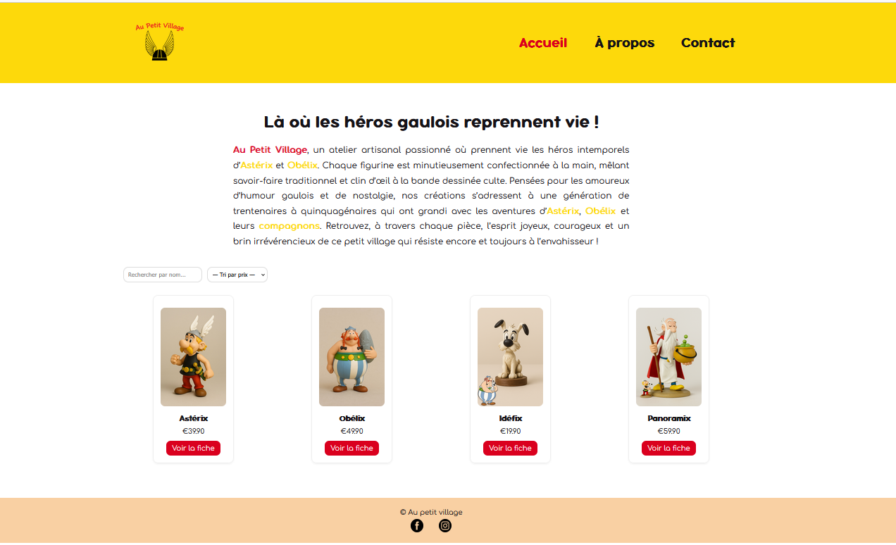
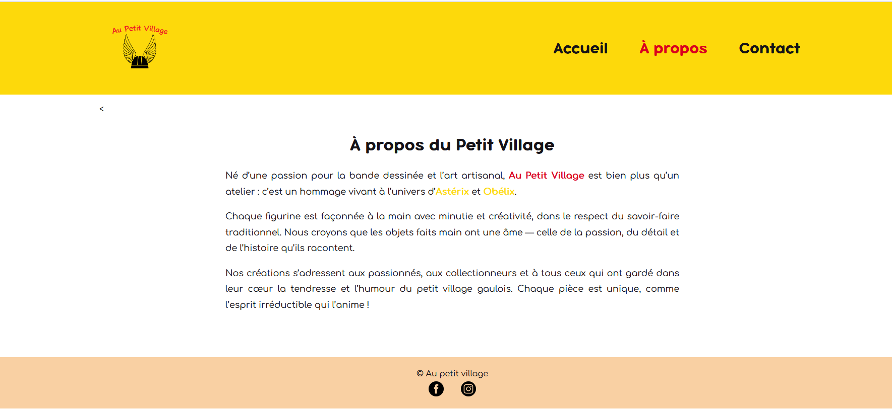
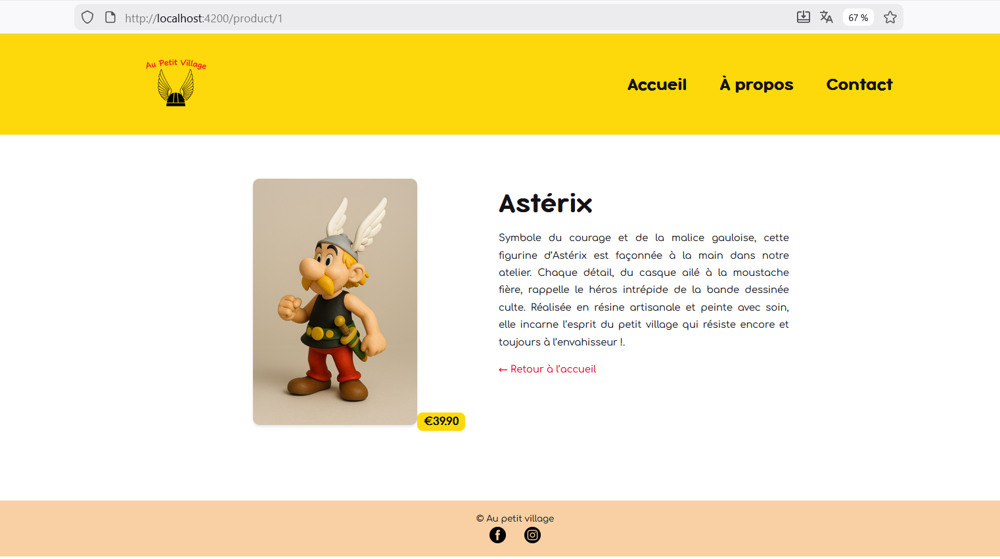
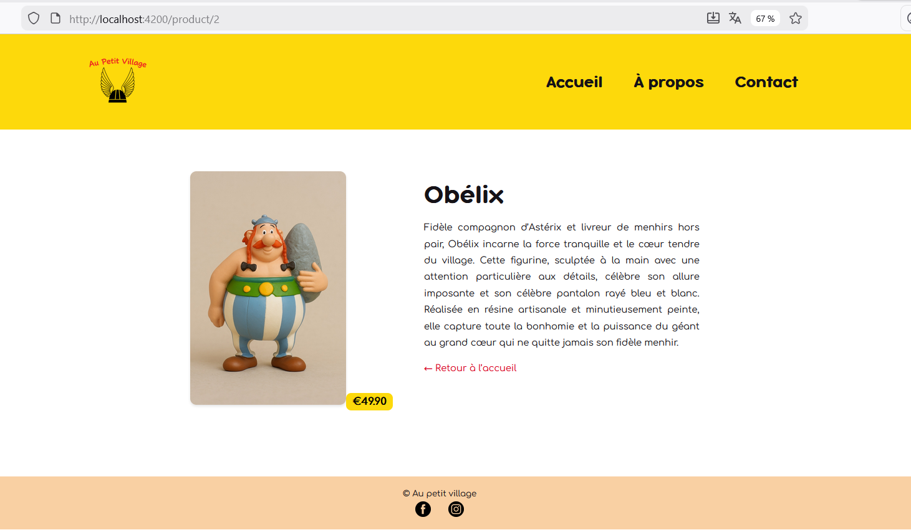
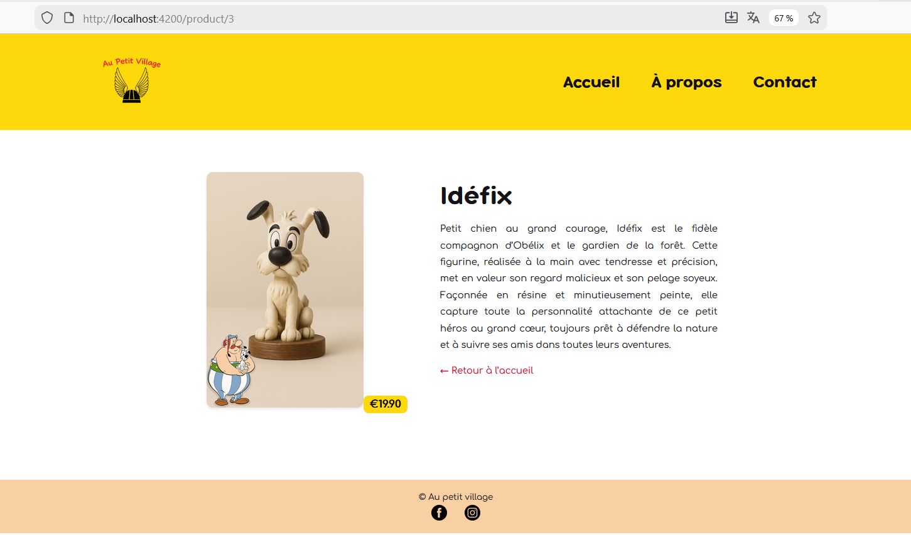
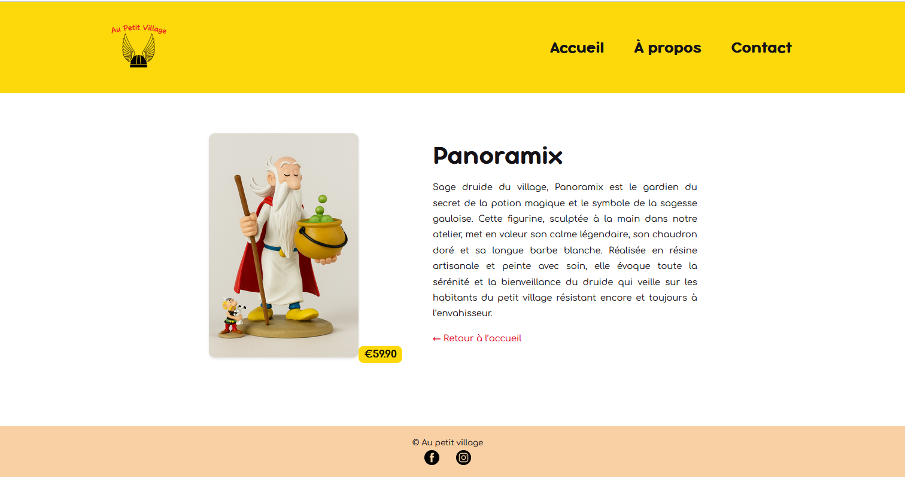
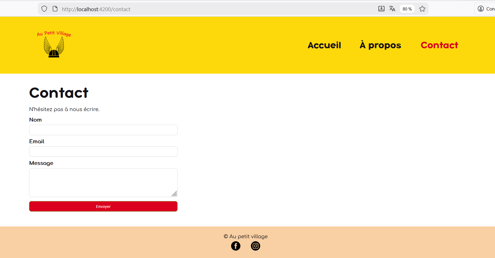

Au Petit Village – Catalogue de Figurines (Angular 17)
Projet Angular réalisé dans le cadre de la formation CEF – Devoir « Au Petit Village »
Ce site présente un catalogue de figurines artisanales inspirées de la bande dessinée Astérix & Obélix, destiné à une clientèle de 30–55 ans, nostalgique de l’univers des Gaulois.

## 📸 Aperçu du site

### 🏠 Page d'accueil

### ℹ️ Page À propos

### 🧾 Fiche produit Astérix

### 🧾 Fiche produit Obélix

### 🧾 Fiche produit Idéfix

### 🧾 Fiche produit Panoramix

### 📬 Page Contact

A.	 Objectifs du projet
Ce projet met en application les compétences Angular suivantes :
•	Standalone Components (Angular 17)
•	Routing (navigation entre pages)
•	Pipes personnalisés
•	Services + requêtes HTTP simulées
•	Gestion des assets (images, favicon, logo)
•	Affichage dynamique via *ngFor
•	Interaction utilisateur : recherche + tri

B.	 Stack technique
•	Angular 17
•	TypeScript
•	HTML5 / CSS3
•	Pipes et Services Angular

C.	Structure du projet

## 📁 Arborescence du projet

Voici la structure principale du projet Angular :
au-petit-village/
au-petit-village/
├── src/
│   ├── app/
│   │   ├── components/
│   │   │   ├── header/
│   │   │   │   ├── header.html
│   │   │   │   ├── header.css
│   │   │   │   └── header.ts
│   │   │   ├── footer/
│   │   │   │   ├── footer.html
│   │   │   │   ├── footer.css
│   │   │   │   └── footer.ts
│   │   ├── pages/
│   │   │   ├── home/
│   │   │   │   ├── home.html
│   │   │   │   ├── home.css
│   │   │   │   └── home.ts
│   │   │   ├── about/
│   │   │   │   ├── about.html
│   │   │   │   ├── about.css
│   │   │   │   └── about.ts
│   │   │   ├── contact/
│   │   │   └── product/
│   ├── assets/
│   │   ├── img/
│   │   │   ├── asterix.jpg
│   │   │   ├── obelix.jpg
│   │   │   ├── idefix.jpg
│   │   │   ├── panoramix.jpg
│   │   └── favicon.ico
│   ├── index.html
│   ├── main.ts
│   ├── styles.css
├── angular.json
├── package.json
├── tsconfig.json
├── README.md
└── screenshots/
    ├── home.png
    ├── about.png
    ├── catalogue.png
    ├── contact.png
    ├── product-asterix.png
    ├── product-obelix.png
    ├── product-idefix.png
    └── product-panoramix.png

*(FIN DU CODE)*

---

D.	Pages et fonctionnalités

1.	Accueil (/)
-	Présentation de l’entreprise
-	Catalogue complet des figurines (Astérix, Obélix, Idéfix, Panoramix)
-	Recherche par nom (Pipe filterByName)
-	Tri par prix croissant / décroissant (Pipe sortByPrice)
-	Carte produit : image, nom, prix, lien “Voir la fiche”

2.	 Fiche produit (/product/:id)
Affichage dynamique d’un produit selon son ID :
-	Image en grand
-	Nom
-	Prix
-	Description détaillée
-	Lien “Retour à l’accueil”

3.	 À propos (/about)
-	Présentation de l’atelier "Au Petit Village"
-	Démarche artisanale
-	Cible : 30–55 ans, nostalgiques des aventures gauloises

4.	Contact (/contact)
•	formulaire 
•	Page accessible depuis le menu

E.	Installation
1. Prérequis
-	Node.js (version LTS)
-	Angular CLI :
                 npm install -g @angular/cli

2. Installation du projet
npm install
3. Lancement en local
ng serve --open
→ Application accessible sur :
http://localhost:4200/

F.	Identité graphique
Identité graphique
•	Couleurs :
-	Sable #F9D0A3
-	Jaune #FDD90B
-	Rouge #DA001E
-	Encre #151217
•	Polices :
-	Bubbleboddy Neue (titres / menu)
-	Comfortaa (texte)
•	Logo intégré : assets/img/logo.png
•	Favicon personnalisé : favicon.ico

G.	Données produits
•	Les figurines sont stockées dans :
src/assets/products.json

Auteur
Projet réalisé par Mialy RABARISON

